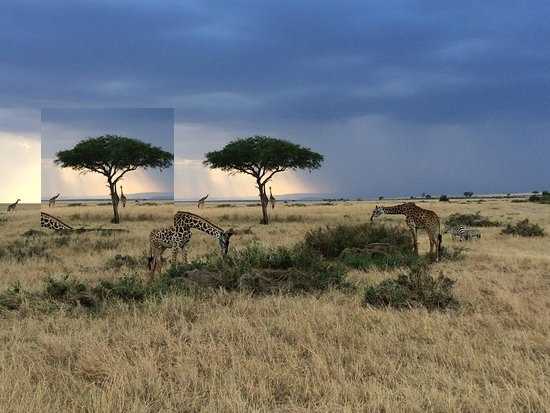

# IFDS - Image Forgery Detection System


IFDS, görüntü manipülasyonu tespiti için geliştirilen Streamlit tabanlı bir analiz uygulamasıdır. Sistem; SIFT, SURF, AKAZE ve ORB gibi klasik OpenCV tabanlı özellik eşleştirme yöntemlerini isteğe bağlı derin öğrenme modelleriyle birlikte çalıştırır. Yüklenen görsel için algoritma bazlı bulgular, nihai karar, karşılaştırmalı analiz tablosu ve indirilebilir PDF/HTML rapor üretir.

## Ekran Görüntüleri

### Uygulama Ana Ekranı


### Analiz Sonucu



### Mobil Görünüm


### Scrum Tablosu


### SonarQube Dashboard


### Graphviz Mimari Grafiği


## Öne Çıkan Özellikler

- Klasik analiz: SIFT, SURF, AKAZE ve ORB dedektörleri.
- AI analiz: Xception CNN ve EfficientNet CNN modelleri için opsiyonel destek.
- Açıklanabilirlik: Xception sonucu için Grad-CAM ısı haritası üretimi.
- Nihai karar: `Authentic`, `Tampered` veya `Review needed` etiketleri için ağırlıklı karar mekanizması.
- Raporlama: Görsel metadata, algoritma sonuçları, karşılaştırma tablosu ve final verdict içeren PDF/HTML raporlar.
- Kullanıcı arayüzü: Modern Streamlit dashboard, durum kartları, analiz seçimi, sonuç kartları ve responsive görünüm.
- Desteklenen formatlar: GIF, JPG/JPEG, PNG, BMP ve TIFF.

## Kalite Özeti

| Araç / Metrik | Sonuç |
| --- | --- |
| Pytest | 58 test geçti |
| Pytest coverage | 95.01% |
| SonarQube Quality Gate | Passed / OK |
| SonarQube coverage | 94.8% |
| Bugs | 0 |
| Vulnerabilities | 0 |
| Security Hotspots | 0 |
| Code Smells | 14 |
| Duplications | 3.0% |
| Lines of Code | 2536 |
| Reliability Rating | A |
| Security Rating | A |
| Maintainability Rating | A |

SonarQube çalıştırma notları ve analiz kanıtı:

- [SonarQube analiz durumu](docs/quality_outputs/sonarqube/SONARQUBE_ANALYSIS_STATUS.md)
- [SonarQube dashboard ekran görüntüsü](docs/quality_outputs/sonarqube/sonarqube_dashboard.png)
- [Coverage XML](docs/quality_outputs/sonarqube/coverage.xml)

## Proje Yapısı

```text
.
├── app.py                  # Streamlit uygulama giriş noktası
├── config/                 # Uygulama ayarları ve model yolları
├── data/
│   ├── raw/                # Yerel ham veri setleri
│   ├── processed/          # İşlenmiş veri çıktıları
│   └── models/             # Model ağırlıkları
├── docs/                   # Dokümantasyon ve teslim çıktıları
├── notebooks/              # Eğitim notebook'ları
├── src/
│   ├── ai_models/          # Xception, EfficientNet ve Grad-CAM bileşenleri
│   ├── classical/          # SIFT, SURF, AKAZE, ORB dedektörleri
│   ├── preprocessing/      # Görüntü yükleme ve ön işleme
│   ├── reporting/          # PDF/HTML rapor üretimi
│   └── verdict.py          # Nihai karar hesaplama servisi
├── tests/                  # Pytest testleri
└── ui/                     # Streamlit arayüz bileşenleri
```

## Kurulum

Python 3.10 veya üzeri önerilir.

```bash
python -m venv .venv
.venv\Scripts\activate
pip install -r requirements.txt
```

macOS/Linux için aktivasyon:

```bash
source .venv/bin/activate
```

Geliştirme ve test bağımlılıkları gerekiyorsa:

```bash
pip install -r requirements-dev.txt
```

## Uygulamayı Çalıştırma

```bash
streamlit run app.py
```

Alternatif olarak Windows sanal ortamı içinden:

```bash
.venv\Scripts\python.exe -m streamlit run app.py
```

Uygulama açıldıktan sonra sol menüden analiz yöntemleri seçilir, desteklenen formatta bir görüntü yüklenir ve `Analizi Başlat` düğmesiyle sonuçlar üretilir.

## Test ve Coverage

```bash
python -m pytest tests -q --cov=src --cov-report=xml --cov-report=term-missing
```

Son doğrulama sonucu:

```text
58 passed
TOTAL: 1202 statements, 60 missing, 95.01% coverage
```

## SonarQube Analizi

Bu projede SonarQube için gerekli temel ayarlar [sonar-project.properties](sonar-project.properties) dosyasında hazırdır.

Temel akış:

```bash
python -m pytest tests -q --cov=src --cov-report=xml --cov-report=term-missing
sonar-scanner.bat -Dsonar.host.url=http://localhost:9000 -Dsonar.token=<local-token>
```

Son başarılı yerel analiz:

```text
Quality Gate: OK / Passed
SonarQube coverage: 94.8%
Bugs: 0
Vulnerabilities: 0
Security Hotspots: 0
Duplications: 3.0%
```

## Model Dosyaları

AI modelleri opsiyoneldir. Model ağırlıkları yoksa uygulama klasik algoritmalar ve raporlama akışıyla çalışmaya devam eder.

Beklenen model yolları:

```text
data/models/xception_finetuned.h5
data/models/efficientnet_finetuned.h5
```

Repoyu klonladıktan sonra model dosyaları eksik görünürse Git LFS kullanın:

```bash
git lfs pull
```

Eğitim metrikleri için [model_metrics.md](docs/model_metrics.md) dosyasına bakabilirsiniz.

## Teslim Dokümanları

Proje ödevi kapsamında hazırlanan ana dokümanlar:

- [Kullanıcı El Kitapçığı](docs/Kullanici_El_Kitapcigi_IFDS.docx)
- [FSM Emek Hesabı](docs/FSM_Emek_Hesabi_IFDS.docx)
- [Doxygen PDF](docs/quality_outputs/doxygen/Doxygen_IFDS_Documentation.pdf)
- [Graphviz mimari SVG](docs/quality_outputs/graphviz/ifds_architecture.svg)
- [Graphviz mimari PDF](docs/quality_outputs/graphviz/ifds_architecture.pdf)
- [Doxygen/Graphviz çağrı grafiği](docs/quality_outputs/graphviz/doxygen_representative_call_graph.svg)
- [Scrum tablo ekran görüntüsü](docs/quality_outputs/scrum/ifds_scrum_table.png)

## Eğitim Notları

`notebooks/` klasöründe Kaggle/CASIA veri setiyle model eğitimi için hazırlanmış notebook'lar bulunur. Yerel veri setleri `data/raw/` altında tutulabilir; bu klasör GitHub'a gönderilmez.

## GitHub'a Göndermeden Önce

- `.env`, Streamlit secrets, sanal ortamlar, veri setleri ve büyük model ağırlıkları repoya eklenmemelidir.
- `data/raw/`, `data/processed/` ve `data/models/` klasörleri yerel çalışma alanı için ayrılmıştır.
- Büyük `.h5` model dosyaları gerekiyorsa normal Git yerine Git LFS ile paylaşılmalıdır.

## Lisans

Bu proje MIT lisansı ile yayınlanır. Ayrıntılar için `LICENSE` dosyasına bakın.
