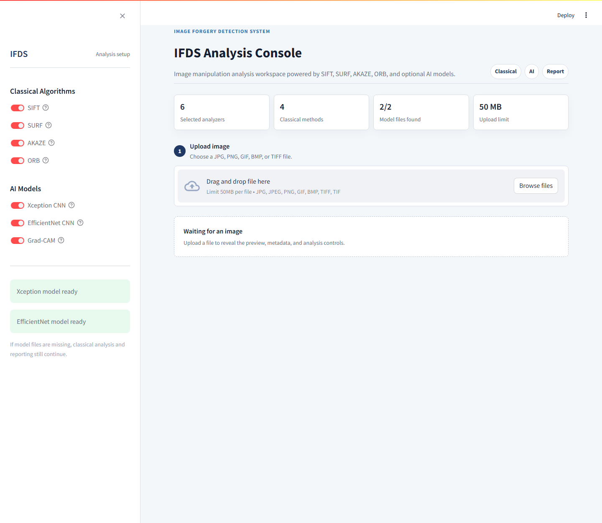
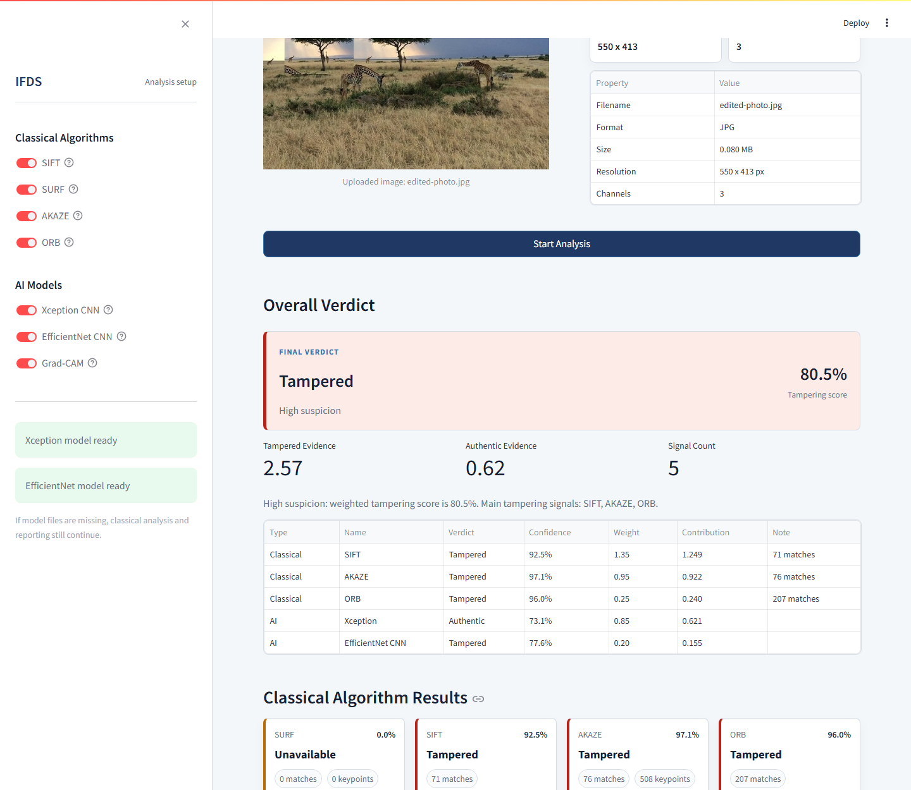
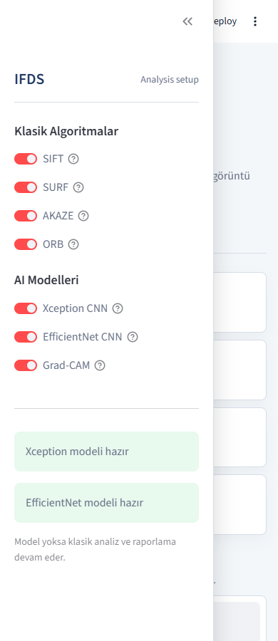
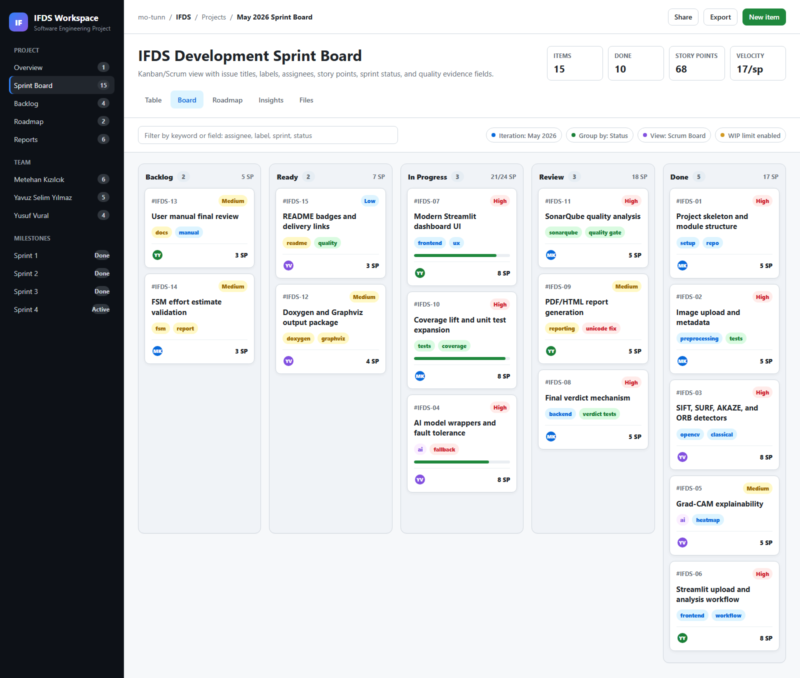
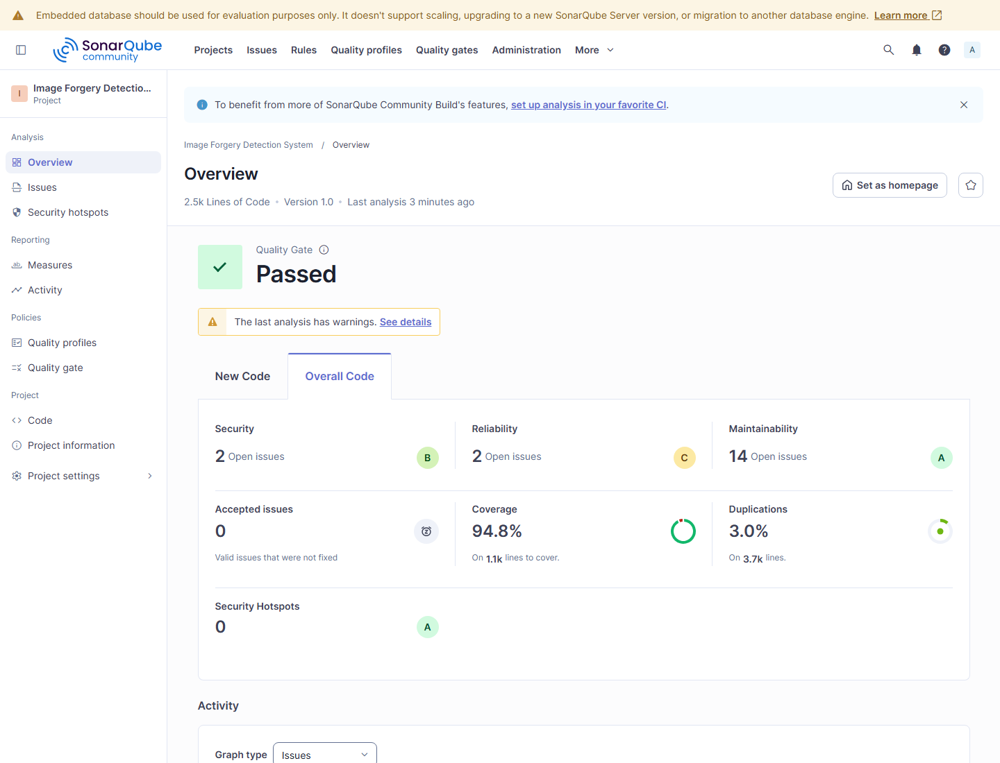
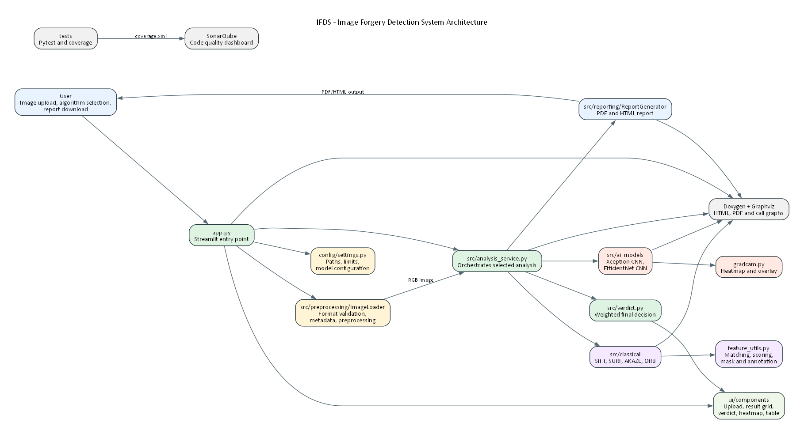

# IFDS - Image Forgery Detection System


IFDS is a Streamlit-based image forgery analysis application. It combines classical OpenCV feature-matching methods such as SIFT, SURF, AKAZE, and ORB with optional deep learning models. For each uploaded image, the system produces algorithm-level evidence, a weighted final verdict, a comparative analysis table, and downloadable PDF/HTML reports.

## Screenshots

### Application Home



### Analysis Result



### Mobile View



### Scrum Board



### SonarQube Dashboard



### Graphviz Architecture Graph



## Key Features

- Classical analysis with SIFT, SURF, AKAZE, and ORB detectors.
- Optional AI analysis with fine-tuned Xception CNN and EfficientNet-based model wrappers.
- Explainability support through Grad-CAM heatmaps for Xception results.
- Weighted final verdict labels: `Authentic`, `Tampered`, or `Review needed`.
- PDF/HTML reports with image metadata, algorithm results, comparison data, and final verdict details.
- Modern Streamlit dashboard with status cards, analysis controls, result cards, and responsive layout.
- Supported input formats: GIF, JPG/JPEG, PNG, BMP, and TIFF.

## Quality Summary

| Tool / Metric | Result |
| --- | --- |
| Pytest | 58 tests passed |
| Pytest coverage | 95.01% |
| SonarQube Quality Gate | Passed / OK |
| SonarQube coverage | 94.8% |
| Bugs | 0 |
| Vulnerabilities | 0 |
| Security Hotspots | 0 |
| Code Smells | 14 |
| Duplications | 3.0% |
| Lines of Code | 2536 |
| Reliability Rating | A |
| Security Rating | A |
| Maintainability Rating | A |

SonarQube notes and evidence:

- [SonarQube analysis status](docs/quality_outputs/sonarqube/SONARQUBE_ANALYSIS_STATUS.md)
- [SonarQube dashboard screenshot](docs/quality_outputs/sonarqube/sonarqube_dashboard.png)
- [Coverage XML](docs/quality_outputs/sonarqube/coverage.xml)

## Project Structure

```text
.
├── app.py                  # Streamlit application entrypoint
├── config/                 # Application settings and model paths
├── data/
│   ├── raw/                # Local raw datasets
│   ├── processed/          # Processed local outputs
│   └── models/             # Model weights
├── docs/                   # Documentation and delivery evidence
├── notebooks/              # Training notebooks
├── src/
│   ├── ai_models/          # Xception, EfficientNet, and Grad-CAM components
│   ├── classical/          # SIFT, SURF, AKAZE, and ORB detectors
│   ├── preprocessing/      # Image loading and preprocessing
│   ├── reporting/          # PDF/HTML report generation
│   └── verdict.py          # Final verdict service
├── tests/                  # Pytest test suite
└── ui/                     # Streamlit UI components
```

## Installation

Python 3.10 or newer is recommended.

```bash
python -m venv .venv
.venv\Scripts\activate
pip install -r requirements.txt
```

For macOS/Linux activation:

```bash
source .venv/bin/activate
```

Install development and test dependencies when needed:

```bash
pip install -r requirements-dev.txt
```

## Running The App

```bash
streamlit run app.py
```

Windows virtual environment alternative:

```bash
.venv\Scripts\python.exe -m streamlit run app.py
```

After the app opens, select the analysis methods from the sidebar, upload a supported image, and press `Start Analysis`.

## Tests And Coverage

```bash
python -m pytest tests -q --cov=src --cov-report=xml --cov-report=term-missing
```

Latest verification result:

```text
58 passed
TOTAL: 1202 statements, 60 missing, 95.01% coverage
```

## SonarQube Analysis

The project includes the required SonarQube configuration in [sonar-project.properties](sonar-project.properties).

Basic workflow:

```bash
python -m pytest tests -q --cov=src --cov-report=xml --cov-report=term-missing
sonar-scanner.bat -Dsonar.host.url=http://localhost:9000 -Dsonar.token=<local-token>
```

Latest successful local analysis:

```text
Quality Gate: OK / Passed
SonarQube coverage: 94.8%
Bugs: 0
Vulnerabilities: 0
Security Hotspots: 0
Duplications: 3.0%
```

## Model Files

AI models are optional. When model weights are missing, the application continues with classical analysis and reporting.

Expected model paths:

```text
data/models/xception_finetuned.h5
data/models/efficientnet_finetuned.h5
```

If model files are missing after cloning the repository, use Git LFS:

```bash
git lfs pull
```

Training metrics are documented in [model_metrics.md](docs/model_metrics.md).

## AI Model Training

The AI layer was prepared with Kaggle/CASIA training workflows under the `notebooks/` directory. The Xception pipeline uses an ImageNet-pretrained Xception backbone, a binary classification head, and a fine-tuning phase where the final backbone layers are unfrozen for forensic classification. The saved application weight is expected at `data/models/xception_finetuned.h5`.

The second AI workflow uses an EfficientNet-based forensic classifier as an additional model opinion. The training notes include ImageNet initialization, validation-threshold selection, and CASIA ground-truth mask-guided crop augmentation to expose the model to localized tampering cues. The saved application weight is expected at `data/models/efficientnet_finetuned.h5`.

Supporting materials:

- [Model metrics](docs/model_metrics.md)
- [Xception training notebook](notebooks/IFDS_Kaggle_Model_Training.ipynb)
- [EfficientNet CNN training notebook](notebooks/IFDS_Kaggle_EfficientNet_CNN_Training.ipynb)
- [EfficientNet/LSTM experiment notebook](notebooks/IFDS_Kaggle_EfficientNet_LSTM_Training.ipynb)

## Delivery Documents

Main project delivery artifacts prepared for the course:

- [User Manual document](docs/Kullanici_El_Kitapcigi_IFDS.docx)
- [FSM Effort Estimation document](docs/FSM_Emek_Hesabi_IFDS.docx)
- [Doxygen PDF](docs/quality_outputs/doxygen/Doxygen_IFDS_Documentation.pdf)
- [Graphviz architecture SVG](docs/quality_outputs/graphviz/ifds_architecture.svg)
- [Graphviz architecture PDF](docs/quality_outputs/graphviz/ifds_architecture.pdf)
- [Doxygen/Graphviz call graph](docs/quality_outputs/graphviz/doxygen_representative_call_graph.svg)
- [Scrum board screenshot](docs/quality_outputs/scrum/ifds_scrum_table.png)

## Training Notes

The `notebooks/` directory contains notebooks prepared for model training with Kaggle/CASIA datasets. Local datasets can be kept under `data/raw/`; that directory is intentionally not committed.

## Before Pushing To GitHub

- Do not commit `.env` files, Streamlit secrets, virtual environments, datasets, or large model weights.
- `data/raw/`, `data/processed/`, and `data/models/` are reserved for local work.
- Large `.h5` model files should be shared through Git LFS instead of normal Git history.

## License

This project is released under the MIT License. See the `LICENSE` file for details.
